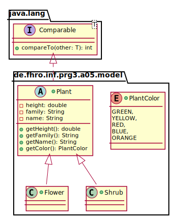
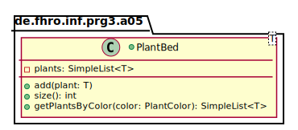
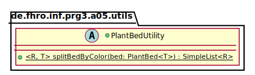

_This is an assignment to the class [Advanced
Programming](https://hsro-inf-fpk.github.io) at the [University of
Applied Sciences Rosenheim](http://www.th-rosenheim.de)._

# Assignment 5: Generics and Bounds

This assignment covers an advanced topic of generics: bounds on type
parameters and wildcards. Bounds describe type constraints of generic
classes or methods that allow to balance type safety with flexibility of
use.

## Setup

1. Create a fork of this repository (button in the right upper corner)
2. Clone the project (get the link by clicking the green _Clone or
download button_)
3. Import the project to your IDE (remember the guide in assignment 1)
4. Validate your environment by running the tests from your IntelliJ and
by running `gradle test` on the command line.

## Groundwork

First, create the model for this assignment:

1. Create the `enum` _PlantColor_
2. Implement the `abstract` class _Plant_
3. Implement the child classes _Flower_ and _Shrub_ 
    _Remarks:_ A shrub is always green; a flower may be any color
**but** green (handle a wrong value in the constructor - throw an
IllegalArgumentException) 
4. Create tests to ensure that your model classes are correct (e.g.
green flowers won't work)

## Basic Bounds

Implement a `PlantBed` which manages a list of plants (use
`SimpleList<T>` which you can find in collections!). 

A `PlantBed` may contain any subclass of `Plant` but nothing else!
Use appropriate bounds when declaring the generic class.

_Remarks:_ The method `getPlantsByColor` is very easy to implement if
you think of the `filter` method of the `SimpleList`! Remember to create
tests for nearly every line you code!

## Bounds on Wildcards

Last but not least we'll look at the PECS (**P**roducer **E**xtends
**C**onsumer **S**uper) principle.

1. Modify the `map` method of the `SimpleList` interface according to
the PECS principle
2. Implement the utility method `splitBedByColor` in a utility class
`PlantBedUtility`. 	Why should this class be declared `abstract` and
have a `private` constructor?

_Remark:_ the above UML diagram for the utility method does not include
any bounds but you **need** some (PECS!) -- the compiler is unable to
capture the types if you implement the method strictly as described in
the UML!
